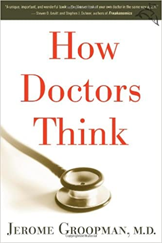
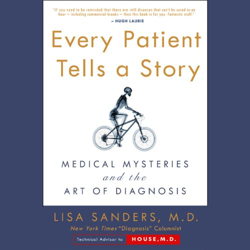

# References

## Links

| Resource | Description |
| :--- | :--- |
| [Patient Advocate Program](https://extension.berkeley.edu/public/category/courseCategoryCertificateProfile.do?method=load&certificateId=40523855#contact-card--accordion) | University of Berkeley's Public Health Departments Patient advocacy program. |
| [How to find best healthcare online](https://www.marketwatch.com/story/how-to-find-the-best-health-info-online-2012-08-22). | Good tools mentions - clinicaltrials.gov etc. |
| [Family Health](https://www.familyhealth.org) |  |

## Books

* [Chasing My Cure](https://www.amazon.com/Chasing-My-Cure-Doctors-Action/dp/1524799610)

* [How Doctors Think](https://www.amazon.com/How-Doctors-Think-Jerome-Groopman/dp/0618610030)

* [Every Patients Tells A Story](https://www.amazon.com/Every-Patient-Tells-Story-Mysteries-dp-B002L7KSXO/dp/B002L7KSXO/)

